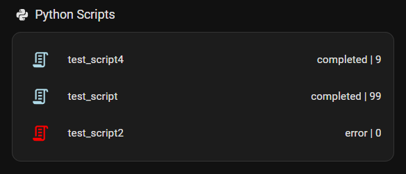

# ha-monitor

Monitor your scripts in Home Assistant via MQTT.

## Installation

```bash
pip install git+https://github.com/albined/ha_monitor.git
```

## Usage

```python
from ha_monitor import ScriptMonitor

with ScriptMonitor("My Script", "mqtt.broker.com", "username", "password") as monitor:
    # Your script code here
    monitor.update(iteration=1, status_message="Processing data")
```

## Example Home Assistant Card

```yaml
# Example: auto-entities card for script monitors

type: custom:auto-entities
card:
  type: entities
  show_header_toggle: false
filter:
  include:
    - domain: binary_sensor
      entity_id: binary_sensor.ha_script_monitor_*
      options:
        type: custom:template-entity-row
        name: |
          {{ state_attr(config.entity, 'friendly_name').split(' ')[-1] }}
        state: >
          {{ state_attr(config.entity, 'status') }} | {{
          state_attr(config.entity, 'iteration') }}
        icon: mdi:script-text-outline
        color: >
           
            red
          
            green
          
            lightblue
          
            grey
          
show_empty: true
```

## Example UI


